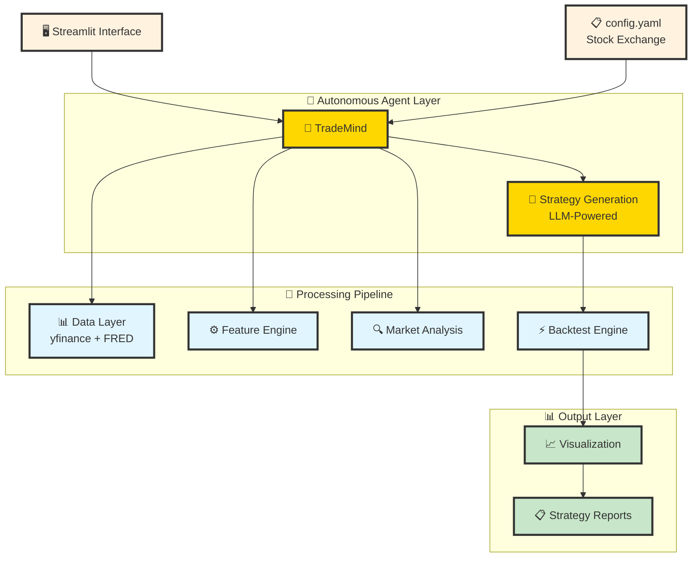

# TradeMind
 To design and build a full web-based intelligent Quant Trading Assistant that
 leverages real-time market data, integrates with trading APIs, and provides
 intelligent resTo design and build a full web-based intelligent Quant Trading
 Assistant that leverages real-time market data, integrates with trading APIs, and
 provides intelligent responses using Gemini's model

 To check the prototype refer to this link 
 
https://trademind-6cjoq6wa3vvaaael2n9qxr.streamlit.app/

## 🚀 Revolutionizing Quantitative Finance with Agentic AI

*Transform stock selection into complete trading strategies in < 5 minutes through autonomous AI agents*

---

## 🎯 Problem Statement

Traditional quantitative trading requires:
- **Extensive Domain Expertise**: Years of experience in strategy development
- **Manual Research Process**: Time-intensive coding and testing cycles  
- **Limited Strategy Exploration**: Human bias restricts discovery space
- **Fragmented Workflows**: Separate tools for data, backtesting, and analysis
- **Static Approaches**: Inability to adapt to changing market conditions

**The Gap**: No unified platform that can autonomously transform a simple stock universe into complete, mathematically-formulated, backtested trading strategies.

## 💡 Our Solution: Complete Agentic Automation

**TradeMind** is the first truly autonomous quantitative trading research platform that:

✅ **Abstracts All Quant Work**: Input stock symbols → Output complete strategies  
✅ **Mathematical Formulation**: Auto-generates strategy equations and logic  
✅ **Real-World Data**: Backtests using live market data via yfinance API  
✅ **Visual Results**: Professional-grade plots and performance analytics  
✅ **Zero Manual Coding**: No programming knowledge required  

### The Magic: From Stocks to Strategies in Minutes

```
INPUT:  ["AAPL", "MSFT", "GOOGL"]  →  AGENT PROCESSING  →  OUTPUT: Complete Trading System
```

1. **You provide**: Stock universe in `config.yaml`
2. **Agent handles**: Data fetching, feature engineering, regime detection, strategy formulation, backtesting, visualization
3. **You receive**: Ready-to-use strategies with mathematical formulas and performance metrics

## 🏗️ Architecture: Agentic AI at the Core



## 🛠️ Technology Stack

### Core AI & Agent Framework
- **🧠 LangChain + LangGraph**: Structured agent workflows and reasoning
- **🤖 Google Gemini Pro**: Large Language Model for strategy planning
- **🔄 Autonomous Agents**: Self-directed planning, execution, and analysis

### Financial Computing Engine  
- **🐍 Python 3.10+**: High-performance numerical computing
- **📊 vectorbt**: Lightning-fast vectorized backtesting
- **📈 yfinance**: Real-time market data integration
- **🏦 FRED API**: Macroeconomic indicators
- **📋 pandas + numpy**: Data manipulation and analysis

### Visualization & Interface
- **🖥️ Streamlit**: Interactive web-based dashboard
- **📊 matplotlib + plotly**: Professional trading charts
- **💾 Parquet**: Efficient data storage format

